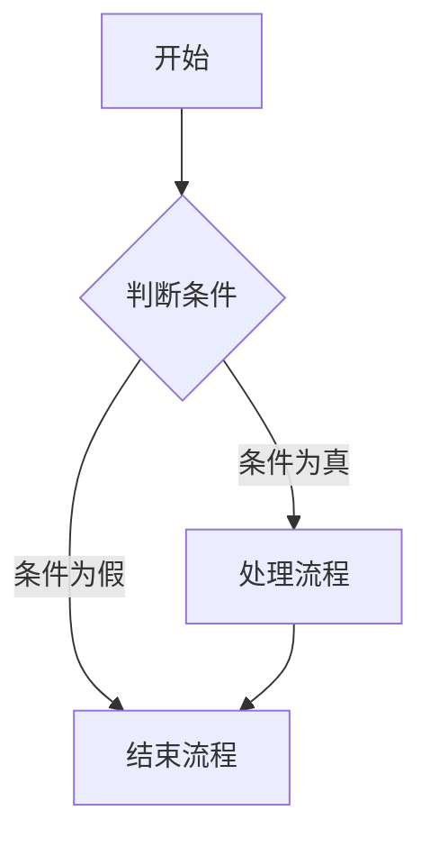
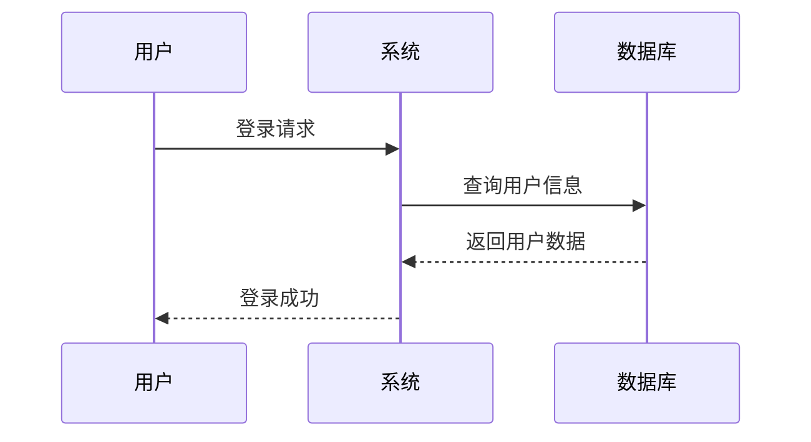
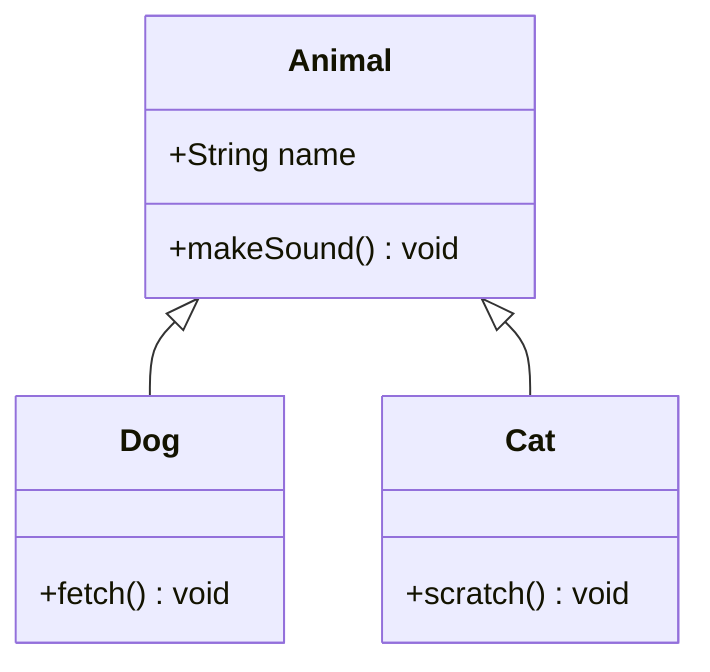
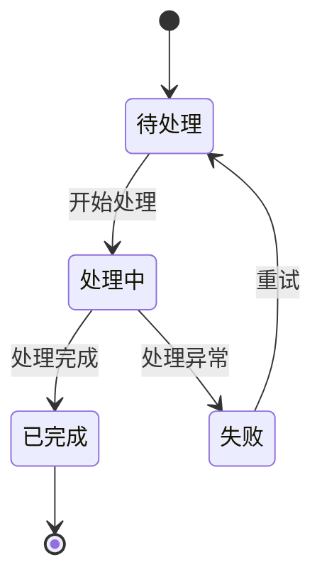
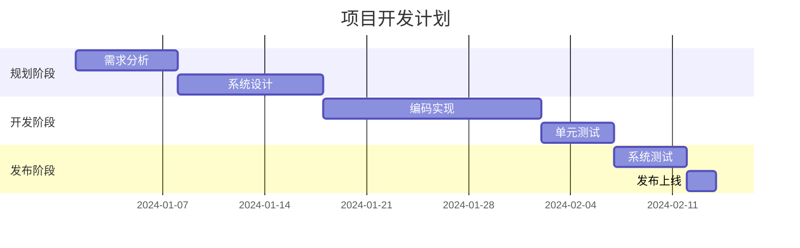
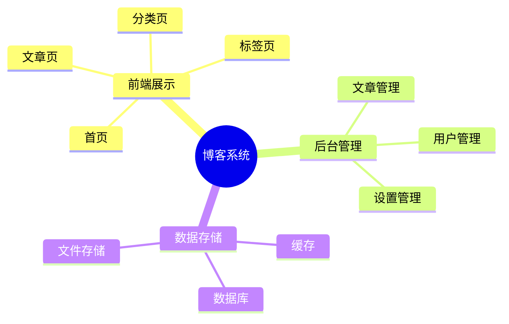
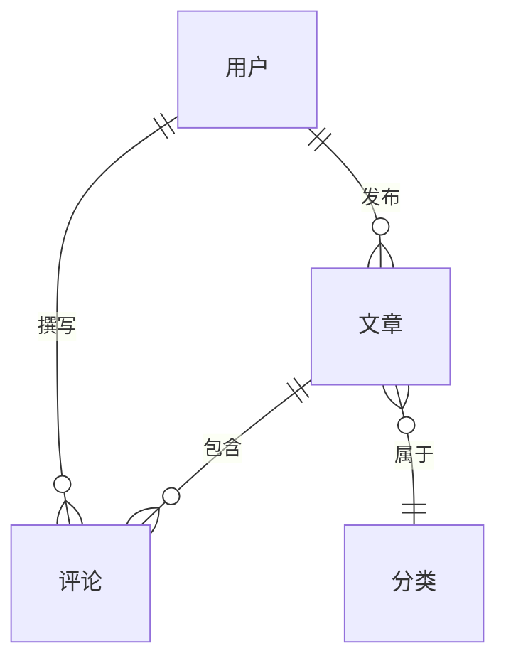

# 标题

# Mermaid 图表测试

## 流程图 (Flowchart)

## 时序图 (Sequence Diagram)

## 类图 (Class Diagram)

## 状态图 (State Diagram)

## 甘特图 (Gantt Chart)

## 思维导图 (Mindmap)

## 关系图 (ER Diagram)

## 总结

以上是 Mermaid 图表的主要类型测试，VitePress 与 Mermaid 的集成非常方便，可以轻松创建各种图表。